# Build plan

Which roles are built when, who owns what, and what each build needs from the owner. Builders follow [BUILD-PROTOCOL.md](BUILD-PROTOCOL.md); this file is for the owner and the design session.

## Waves and dependencies

Parallel builds are safe because each role builds against the fixed [contracts](contracts/README.md), not against another role's code. A role that needs another role's behavior uses the contract and a stub.

```mermaid
flowchart LR
    W0["Wave 0: contracts, context, protocol - done"] --> W1
    subgraph W1["Wave 1: foundation"]
        V["02 Verifier"]
        G["03 Guardian"]
        L["04 Librarian"]
        D["05 Data Steward"]
    end
    W1 --> W2
    subgraph W2["Wave 2: sharpest pains"]
        O["06 Operations Manager"]
        C["07 Controller"]
        S["01 Chief of Staff"]
    end
    W2 --> W3
    subgraph W3["Wave 3: money"]
        F["08 CFO"]
        T["09 Tax and Household Strategist"]
    end
    W3 --> W4
    subgraph W4["Wave 4: growth"]
        M["10 Growth Marketer"]
        A["11 Business Advisor"]
        K["12 AI Learning Coach"]
        N["13 Venture Architect"]
    end
```

Two builds at a time is the recommended ceiling because Claude Pro usage is shared and capped. A sensible order within waves:

| Round | Sessions | Why together |
|---|---|---|
| 1 | 02 Verifier and 03 Guardian | They define the gates everything else uses |
| 2 | 04 Librarian and 05 Data Steward | Memory and clean data for the pipelines |
| 3 | 06 Operations Manager and 07 Controller | The owner's two sharpest pains |
| 4 | 01 Chief of Staff, then a review pass over the foundation | Needs the real cards from the earlier roles |
| 5 | 08 CFO and 09 Tax and Household Strategist | Tax has a December 31 clock; see below |
| 6 to 8 | 10 to 13, two at a time | Deferred by the owner's priorities |

Independent review sessions sit between rounds. A role is not "done" until its review passes and the owner merges.

## Ownership map (single writer per path)

| Role | Owns `agents/` folder | Owns skills in `.claude/skills/` | Owns knowledge namespaces |
|---|---|---|---|
| 01 Chief of Staff | `01-chief-of-staff` | plan-and-route, gate-enforce, brief-builder, budget-watch, escalation-triage | `orchestration` |
| 02 Verifier | `02-verifier` | claim-evidence-audit, recompute-in-code, source-check, adversarial-review, golden-set-calibration | `verification` |
| 03 Guardian | `03-guardian` | risk-classify, preflight-brief, secrets-hygiene, rollback-plan, skill-vetting | `security` |
| 04 Librarian | `04-librarian` | kb-lookup, deep-research, source-grading, distill-and-tag, refresh-expiring | `kb-meta` (and the `knowledge/` skeleton) |
| 05 Data Steward | `05-data-steward` | schema-validate, anomaly-detect, lineage-log, cross-source-reconcile | `data-quality` |
| 06 Operations Manager | `06-operations-manager` | forecast-demand, recommend-order, submit-order, inventory-reconcile, waste-review, backtest | `ordering` |
| 07 Controller | `07-controller` | statement-audit, bank-card-reconciliation, cutoff-accrual-check, variance-analysis, accountant-query-drafter, evidence-pack | `accounting` |
| 08 CFO | `08-cfo` | 13-week-cash-forecast, debt-scenarios, unit-economics, runway-alert | `finance` |
| 09 Tax and Household | `09-tax-household-strategist` | tax-optimization-research, deduction-evidence-tracker, deadline-calendar, household-budget | `tax` |
| 10 Growth Marketer | `10-growth-marketer` | content-ideation, calendar-build, copywriting, performance-review | `marketing` |
| 11 Business Advisor | `11-business-advisor` | kpi-dashboard, margin-and-pricing, competitor-scan, exit-readiness-score | `strategy` |
| 12 AI Learning Coach | `12-ai-learning-coach` | curriculum-builder, weekly-ai-digest, paper-and-doc-summary, build-challenge, portfolio-tracker | `ai-learning` |
| 13 Venture Architect | `13-venture-architect` | money-flow-mapping, opportunity-scoring, offer-design, case-study-builder, pilot-design | `ventures` |

## What each build needs from the owner

| Need | Blocks | How to provide it |
|---|---|---|
| **A private repo** for real data and exported skills | Real-data work for 06, 07, 08, 09 | Create a private GitHub repo (for example `business-private`) and attach it to the session. Until then those roles build and test on synthetic data |
| **Export of existing skills** (item-ordering, reconciliation-verifier, financial-reviewer and the related ones) | 06, 07, parts of 08 | Copy each skill's folder into the private repo, or attach the files to the builder session. They hold accumulated pitfalls, rules and lessons that become the roles' brain rules. Never commit them here |
| **Order submission decision** (cart link, signed-in browser, or another channel; the fallback at 7:45pm) | The submit step of 06 | Answer when the Operations Manager session asks. Until then it builds "prepare only" |
| **The shop's books system and accountant file formats** | 07 | Answer when the Controller session asks; provide samples via the private store |
| **POS export format and the Notion inventory schema** | 05, 06 | Provide a redacted sample export |
| **Confirmation of plan features** (models, scheduled tasks) | Runtime wiring for all | Check the model picker and the scheduled-tasks screen |

## Time-sensitive: tax

Many year-end tax moves in Canada must be completed by December 31. Do not wait for Wave 3: after the Librarian is built, run its first research pass on year-end planning for an incorporated Ontario business and for household tax (public sources only). The Tax and Household role then builds on those stored findings, and everything is confirmed with a CPA.

## How to launch a session

| Option | How | Notes |
|---|---|---|
| A (recommended) | Claude Code on the web: create the session with `gh0stl0nely/agent-os` selected as its repository, then paste the role's kickoff prompt from [KICKOFF-PROMPTS.md](KICKOFF-PROMPTS.md) | Once the repo is cloned, `CLAUDE.md` loads automatically, so every session starts with the same context. A session created without the repo has no `CLAUDE.md` and no brief; the prompt then makes it attach and clone the repo, which needs your approval. Cloud sessions keep running if you close the tab |
| B | Claude Code on desktop or terminal in a separate git worktree per role | Same prompts; worktrees keep the parallel branches apart |
| C | Ask the design session to launch a builder | Uses the same plan allowance. Not the default, because separate human-launched sessions keep each role's context clean |

For the reviewer: start another fresh session with the review prompt. Never review in the builder's session.
