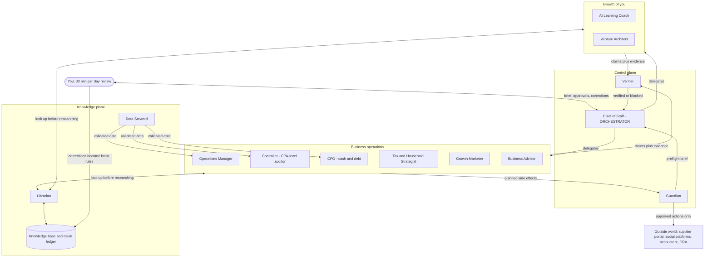
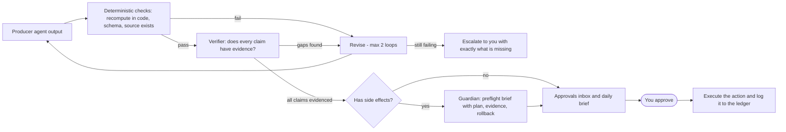
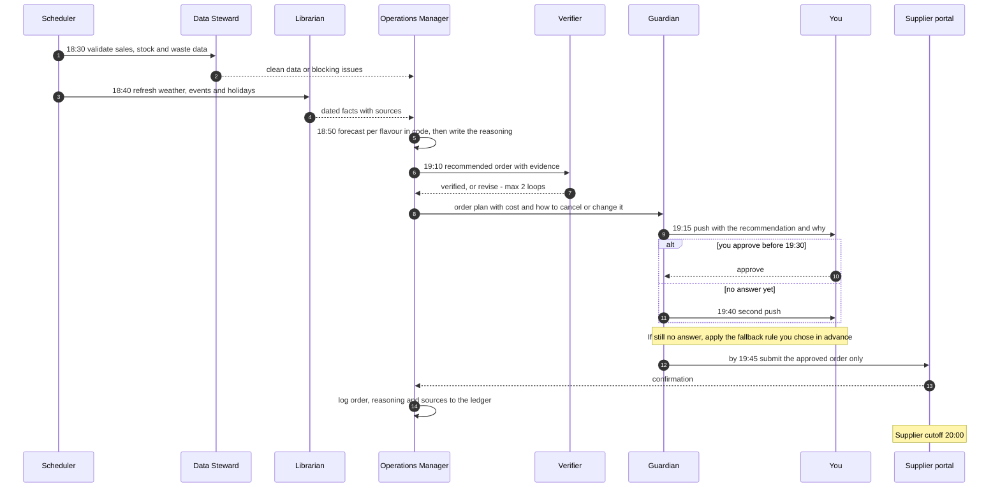
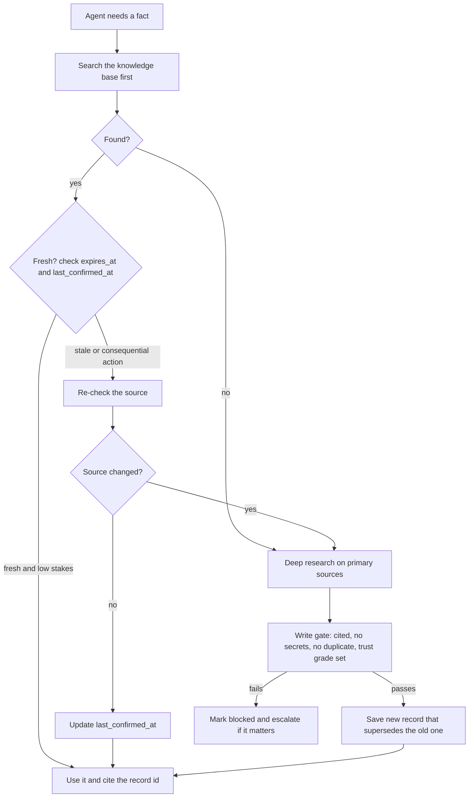
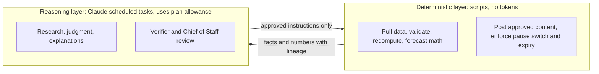

# Architecture

All diagrams are Mermaid and render directly on GitHub. Names match [roster.md](roster.md).

## 1. System map

The Chief of Staff delegates and is the only agent that talks to the owner. Every producer output goes through the Verifier. Anything with a side effect goes through the Guardian. Knowledge is looked up before it is researched.

## 2. Verification gate

Deterministic checks run first because a model checking its own model family can share its blind spots. The Verifier then asks one question per claim: is there evidence? Two revise loops at most, then escalate with exactly what is missing.

## 3. Nightly ordering pipeline

The hard clock: numbers by 7:30pm, order submitted by 7:45pm, supplier cutoff at 8:00pm. Times are proposals to be tuned during the build. The Guardian's plan includes the cost and how the order can be cancelled or changed.

How the order reaches the supplier is an open decision (see [README.md](README.md)): the portal is password-gated and agents are not allowed to type passwords.

## 4. Knowledge lookup: memory first, research if stale

## 5. Execution layers

On Claude Pro, usage is shared and capped, and Pro does not include API usage. So scripts that need no model run on a free scheduler (the existing Threads poster already runs this way on GitHub Actions), and only reasoning steps use the Claude allowance. Whether scheduled tasks are available on the owner's plan is unverified.

## Attention routing

| Tier | When | How |
|---|---|---|
| Normal | Most output | One approvals inbox, reviewed once or twice a day |
| Time-critical | The 7:30pm order | Phone push at about 7:15 and again at about 7:40, plus the fallback rule |
| Critical | Runway alert, security issue | A high-priority push channel (tool choice and pricing to be verified before relying on it) |
